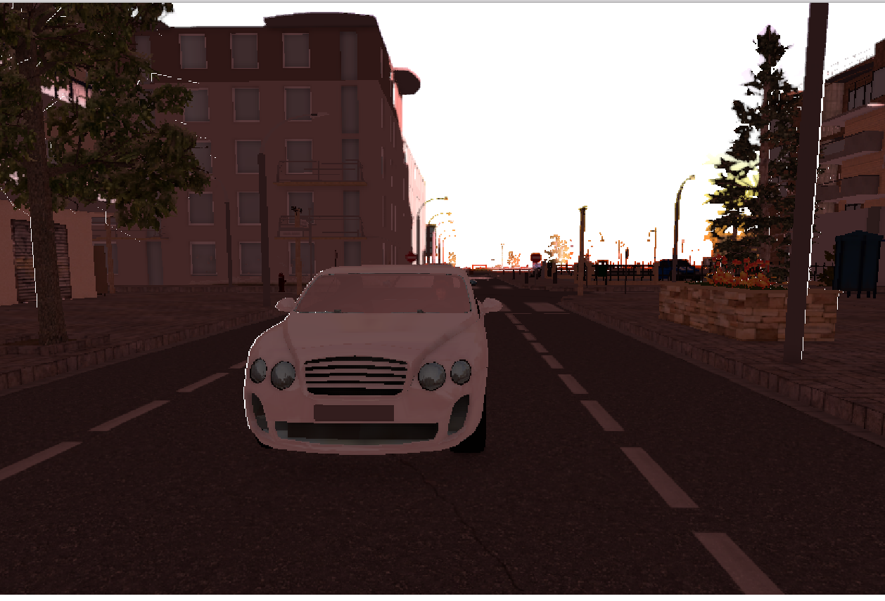
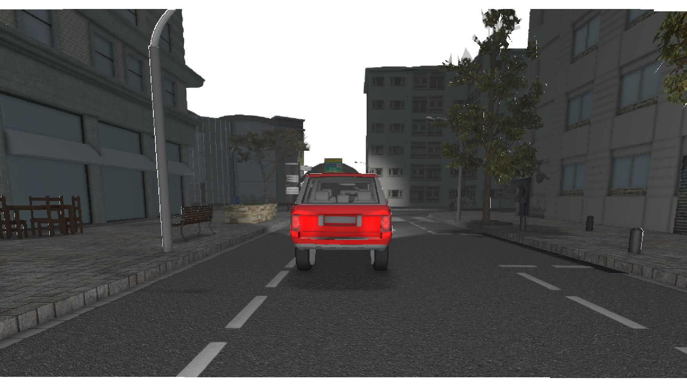
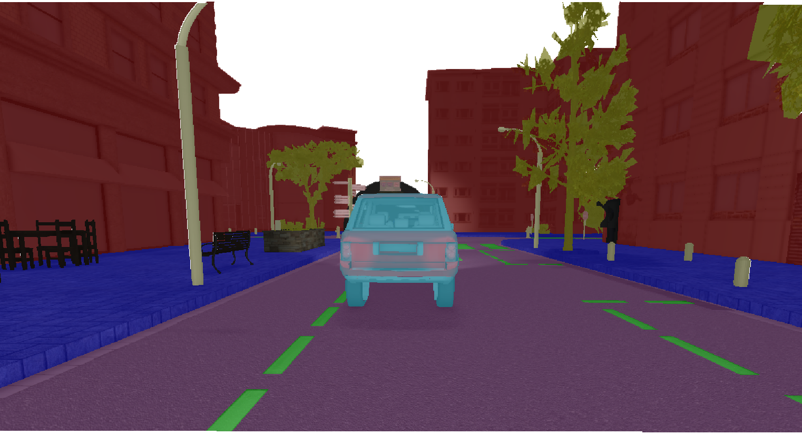
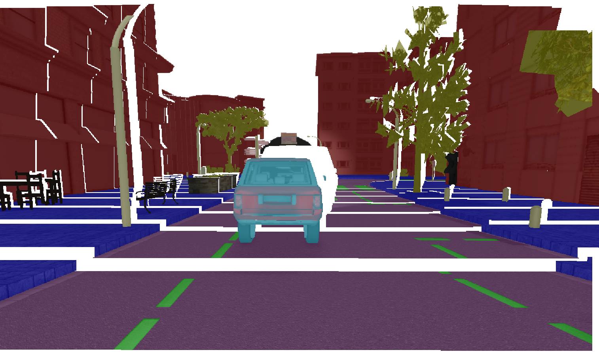

# DepthRGB

This projects combines a depth image with a RGB image to create a 3D scene.

Some examples are:

You can also show the semantic maps in this 3d world by setting `showSemSegmentation`
to true in main.py

If you move the camera a bit you see that the scene is 3D:

# Requirements

1. Install https://github.com/uoip/pangolin and build it
2. Once pangolin is built, copy the pangolin.so file to this folder
3. pip install -r requirements.txt`
